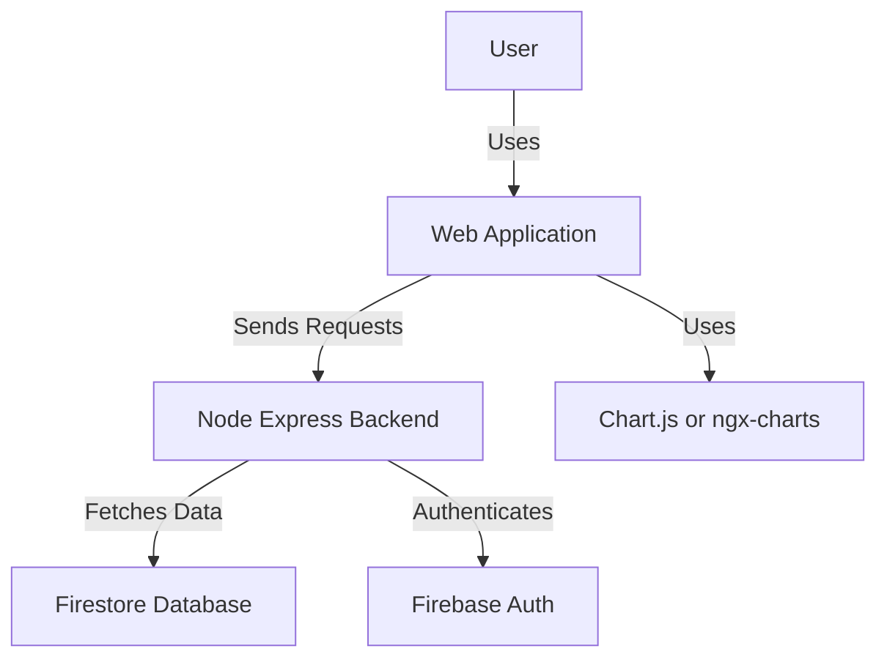

# System architecture for **my_finances**

## Overview

my_finances is a web application for personal use that allows users to register incomes and expenses, view statistics with interactive graphs, and get a summary of their financial situation.

## Frontend

### Tech Stack

- **Language**: TypeScript
- **Framework**: Angular_SPA
- **Styling**: sCSS
- **State Management**: None
- **Routing**: Angular_Router
- **API**: Fetch

### Architecture

- **Software Architecture**: Layered
- **Programming Paradigm**: Functional
- **Folder Structure**:
  ```
  - src/
    - app/ (pages and repositories)
    - models/ (data models)
    - utils/ (helpers and shared components)
  ```

### Presentation

- **Front runtime**: SPAs
- **Interactions**: Routes
- **Style**: Responsive, Dark_Mode
- **Colors**: Lime, Cyan
- **Fonts**: Roboto

## Backend

### Tech Stack

- **Language**: TypeScript
- **Framework**: Node_Express

### Architecture

- **Software Architecture**: Layered
- **Programming Paradigm**: Functional
- **Folder Structure**:
  ```
  - src/
    - api/ (controllers and repositories)
    - models/ (data models)
    - utils/ (helpers)
  ```

### Authentication

- **Authentication**: JWT

## Database

- **Database Type**: Relational
- **Database**: SQLite
- **Naming Convention**: camelCase
- **Tables or Collections**: plural
- **PK Identifiers**: id
- **FK Indexes**: user_id
- **Auditing**: created_at, updated_at


## Diagram



_End of System Architecture Document for my_finances_ 