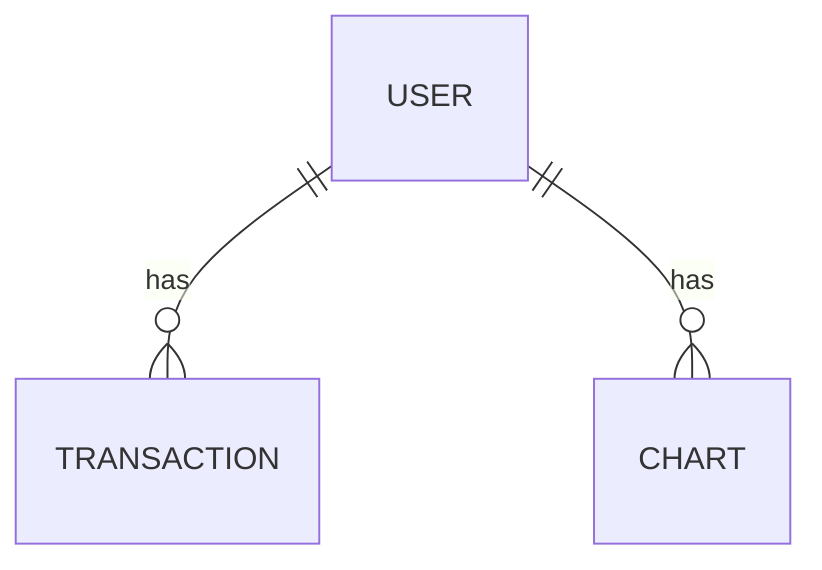

# Data Model for **my_finances**

This document describes the data model for the **my_finances** project. It covers the primary entities, their attributes, relationships, and provides a visual representation using a mermaid diagram.

## Main Entities

### User
- **Description**: Represents a user of the application.
- **Attributes**:
  - **user_id**: String - mandatory - unique
  - **email**: String - mandatory - unique
  - **password**: String - mandatory
  - **created_at**: Date - mandatory
  - **updated_at**: Date - mandatory

### Transaction
- **Description**: Represents an income or expense transaction.
- **Attributes**:
  - **transaction_id**: String - mandatory - unique
  - **user_id**: String - mandatory
  - **amount**: Number - mandatory
  - **category**: String - mandatory
  - **date**: Date - mandatory
  - **description**: String
  - **type**: String - mandatory (e.g., income or expense)
  - **status**: String (e.g., 'active', 'deleted', 'modified')
  - **created_at**: Date - mandatory
  - **updated_at**: Date - mandatory

### Chart
- **Description**: Represents the data used for displaying charts.
- **Attributes**:
  - **chart_id**: String - mandatory - unique
  - **user_id**: String - mandatory
  - **data**: JSON - mandatory
  - **type**: String - mandatory (e.g., bar, line, pie)
  - **period**: String - mandatory
  - **filters**: Array
  - **created_at**: Date - mandatory
  - **updated_at**: Date - mandatory

## Relationships

- **User** **(one)** ||--o{ **Transaction** **(many)**
  - Description: A user can have multiple transactions.

- **User** **(one)** ||--o{ **Chart** **(many)**
  - Description: A user can have multiple charts based on their transactions.

- **Chart** **(one)** ||--o{ **Transaction** **(many)**
  - Description: A chart can have multiple transactions.

## Mermaid Diagram

_End of Data Model Document for my_finances_ 